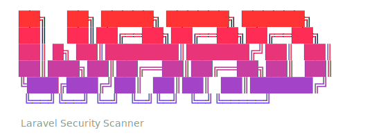

<p align="center">
  
</p>

<p align="center"><strong>A security scanner built specifically for Laravel.</strong></p>

Ward understands your Laravel application — its routes, models, controllers, middleware, Blade templates, config files, `.env` secrets, Composer dependencies, and more. It doesn't just grep for patterns. It resolves your project's structure first, then runs targeted security checks against it.

---

## Why Ward?

Laravel gives you a lot out of the box — CSRF protection, Eloquent's mass assignment guards, Bcrypt hashing, encrypted cookies. But it's easy to misconfigure things or leave gaps that standard linters won't catch:

- `APP_DEBUG=true` shipping to production
- A controller action with no authorization check
- `$guarded = []` on a model that handles payments
- `DB::raw()` with interpolated user input
- Session cookies without the `Secure` flag
- An API route group missing `auth:sanctum`
- Outdated Composer packages with known CVEs
- Blade templates using `{!! !!}` on user data

Ward checks for all of these and more. It's designed to fit into the workflow you already have — run it locally during development, or wire it into CI to gate deployments.

---

## How It Works

Ward scans your project in a pipeline of five stages:

```
 Provider  -->  Resolvers  -->  Scanners  -->  Post-Process  -->  Report
```

**1. Provider** — Locates and prepares your project source. Supports local paths and git URLs (shallow clone).

**2. Resolvers** — Parses `composer.json`, `composer.lock`, `.env`, and `config/*.php` to build a structured project context: framework version, PHP version, installed packages, environment variables, config files.

**3. Scanners** — Independent security checks run against the resolved context:

| Scanner              | What it checks                                                                                                                                             |
| -------------------- | ---------------------------------------------------------------------------------------------------------------------------------------------------------- |
| `env-scanner`        | `.env` misconfigurations — debug mode, empty APP_KEY, non-production env, weak credentials, leaked secrets in `.env.example`                               |
| `config-scanner`     | `config/*.php` — hardcoded debug mode, session cookie flags, CORS wildcards, hardcoded credentials in config files                                         |
| `dependency-scanner` | `composer.lock` — **live CVE lookup** via [OSV.dev](https://osv.dev) against the entire Packagist advisory database (no hardcoded list, always up-to-date) |
| `rules-scanner`      | 40 built-in YAML rules covering secrets, SQL/command/code injection, XSS, debug artifacts, weak crypto, auth issues, mass assignment, unsafe file uploads  |

**4. Post-Process** — Deduplicates findings, filters by minimum severity (from config), and diffs against your last scan to show what's new vs resolved.

**5. Report** — Generates output in multiple formats and saves scan history for trending.

---

## Quick Start

### Install

```bash
go install github.com/eljakani/ward@latest
```

> **Note:** `@latest` resolves to the latest **Git tag** (e.g., `v0.3.0`). To install a specific version: `go install github.com/eljakani/ward@v0.3.0`

Make sure `$GOPATH/bin` is in your `PATH` (Go installs binaries there):

```bash
export PATH="$PATH:$(go env GOPATH)/bin"
```

> Add this line to your `~/.bashrc` or `~/.zshrc` to make it permanent.

Or build from source:

```bash
git clone https://github.com/Eljakani/ward.git
cd ward
make build    # builds ./ward with embedded version, commit, and date
make install  # installs to $GOPATH/bin
```

### Initialize

```bash
ward init
```

This creates `~/.ward/` with your configuration and 40 default security rules:

```
~/.ward/
├── config.yaml            # Main configuration
├── rules/                 # Security rules (YAML)
│   ├── secrets.yaml       # 7 rules: hardcoded passwords, API keys, AWS creds, JWT, tokens
│   ├── injection.yaml     # 6 rules: SQL injection, command injection, eval, unserialize
│   ├── xss.yaml           # 4 rules: unescaped Blade output, JS injection
│   ├── debug.yaml         # 6 rules: dd(), dump(), phpinfo(), debug bars
│   ├── crypto.yaml        # 5 rules: md5, sha1, rand(), mcrypt, base64-as-encryption
│   ├── security-config.yaml # 7 rules: CORS, SSL verify, CSRF, mass assignment, uploads
│   ├── auth.yaml          # 5 rules: missing middleware, rate limiting, loginUsingId
│   └── custom-example.yaml # Disabled template showing how to write your own rules
├── reports/               # Scan report output
└── store/                 # Scan history for diffing between runs
```

### Scan a Local Project

```bash
ward scan /path/to/your/laravel-project
```

### Scan a Remote Repository

```bash
ward scan https://github.com/user/laravel-project.git
```bash
ward scan ./my-app --output json
```

When no TTY is available or `--output` is specified, Ward runs in headless mode with styled text output — no interactive TUI.

### CI Exit Codes (`--fail-on`)

```bash
# Exit code 1 if any High or Critical findings exist
ward scan . --output json --fail-on high

# Fail on any finding (including Info)
ward scan . --output json --fail-on info
```

Severity threshold is inclusive: `--fail-on medium` fails on Medium, High, and Critical.

### Baseline (Suppress Known Findings)

On first run, generate a baseline of current findings:

```bash
ward scan . --output json --update-baseline .ward-baseline.json
```

On subsequent runs, suppress those known findings:

```bash
ward scan . --output json --baseline .ward-baseline.json --fail-on high
```

Only **new** findings (not in the baseline) will be reported. Commit `.ward-baseline.json` to your repo to track acknowledged findings.

### CI Pipeline Example

```yaml
- name: Run Ward
  run: |
    ward scan . --output json,sarif \
      --baseline .ward-baseline.json \
      --fail-on high
```

> 📖 **Full CI/CD guide** — GitHub Actions, GitLab CI, Bitbucket, Azure DevOps, Docker, caching, and troubleshooting: [docs/ci-integration.md](docs/ci-integration.md)

---

## Report Formats

Configure output formats in `~/.ward/config.yaml`:

```yaml
output:
  formats:
    - json       # ward-report.json  — machine-readable
    - sarif      # ward-report.sarif — GitHub Code Scanning / IDE integration
    - html       # ward-report.html  — standalone visual report (dark theme)
    - markdown   # ward-report.md    — text-based, great for PRs
  dir: ./reports
```

JSON is always generated as a baseline. All report files are written to the configured output directory (defaults to `.`).

### GitHub Code Scanning Integration

Add the SARIF format and upload it in your CI workflow:

```yaml
- name: Run Ward
  run: ward scan . --output json

- name: Upload SARIF
  uses: github/codeql-action/upload-sarif@v3
  with:
    sarif_file: ward-report.sarif
```

See the GitHub Actions example below for a complete workflow.

---

## Configuration

Ward loads its config from `~/.ward/config.yaml`:

```yaml
# Minimum severity to report: info, low, medium, high, critical
severity: info

output:
  formats: [json, sarif, html, markdown]
  dir: ./reports

scanners:
  disable: []     # scanner names to skip, e.g. ["dependency-scanner"]

rules:
  disable: []     # rule IDs to silence, e.g. ["DEBUG-001", "AUTH-001"]
  override:       # change severity for specific rules
    DEBUG-002:
      severity: low
  # custom_dirs:  # load rules from additional directories
  #   - /path/to/team-rules

providers:
  git_depth: 1    # shallow clone depth (0 = full history)
```

---

## Custom Rules

Drop `.yaml` files into `~/.ward/rules/` and Ward picks them up automatically. See `custom-example.yaml` for a documented template.

```yaml
rules:
  - id: TEAM-001
    title: "Hardcoded internal service URL"
    description: "Detects hardcoded URLs to internal services."
    severity: medium
    category: Configuration
    enabled: true
    patterns:
      - type: regex
        target: php-files
        pattern: 'https?://internal-service\.\w+'
    remediation: |
      Use environment variables:
        $url = env('INTERNAL_SERVICE_URL');
```

### Pattern Types

| Type          | Description                              |
| ------------- | ---------------------------------------- |
| `regex`       | Regular expression match (line-by-line)  |
| `contains`    | Exact substring match                    |
| `file-exists` | Check if a file matching the glob exists |

### Targets

| Target            | Files matched                                 |
| ----------------- | --------------------------------------------- |
| `php-files`       | All `.php` files (recursive, skips `vendor/`) |
| `blade-files`     | `resources/views/**/*.blade.php`              |
| `config-files`    | `config/*.php`                                |
| `env-files`       | `.env`, `.env.*`                              |
| `routes-files`    | `routes/*.php`                                |
| `migration-files` | `database/migrations/*.php`                   |
| `js-files`        | `resources/js/**/*.{js,ts,jsx,tsx}`           |
| `path/to/*.ext`   | Any custom glob pattern                       |

### Negative Patterns

Set `negative: true` to trigger when a pattern is **absent** — useful for "must have X" checks:

```yaml
patterns:
  - type: contains
    target: blade-files
    pattern: "@csrf"
    negative: true    # fire if @csrf is NOT found
```

### Rule Overrides

Disable or change severity of any rule in `config.yaml` without editing rule files:

```yaml
rules:
  disable: [DEBUG-001, DEBUG-002]
  override:
    CRYPTO-003:
      severity: low
    AUTH-001:
      enabled: false
```

---

## Scan History

Ward automatically saves each scan to `~/.ward/store/`. On subsequent scans of the same project, it shows what changed:

```
  [info] vs last scan: 2 new, 3 resolved (12->11)
```

This lets you track security posture over time and catch regressions.

---

## Terminal UI

Ward's TUI is built on [Bubble Tea](https://github.com/charmbracelet/bubbletea) and adapts to both light and dark terminals automatically.

### Scan View

Displayed while scanning is in progress — shows pipeline stage progress, scanner status with spinners, live severity counts, and a scrollable event log.

### Results View

Displayed after scan completion — sortable findings table with severity badges, category grouping, and a detail panel showing description, code snippet, remediation, and references.

### Keyboard Shortcuts

| Key                | Action                                       |
| ------------------ | -------------------------------------------- |
| `q` / `Ctrl+C`     | Quit                                         |
| `?`                | Toggle help                                  |
| `Tab`              | Switch view or panel                         |
| `j` / `k` / arrows | Navigate findings                            |
| `s`                | Cycle sort column (severity, category, file) |
| `Esc`              | Back to scan view                            |

---

## CI Integration

### GitHub Actions

Add this workflow to your Laravel project as `.github/workflows/ward.yml`:

```yaml
name: Ward Security Scan
on: [push, pull_request]

jobs:
  security-scan:
    runs-on: ubuntu-latest
    steps:
      - uses: actions/checkout@v4

      - name: Install Ward
        run: go install github.com/eljakani/ward@latest

      - name: Run Ward
        run: ward init && ward scan . --output json

      - name: Upload SARIF
        if: always()
        uses: github/codeql-action/upload-sarif@v3
        with:
          sarif_file: ward-report.sarif
```

### GitLab CI

```yaml
ward-scan:
  image: golang:latest
  script:
    - go install github.com/eljakani/ward@latest
    - ward init && ward scan . --output json
  artifacts:
    paths:
      - ward-report.*
    when: always
```

---

## Built-in Scanners

### env-scanner (8 checks)

| ID      | Check                              | Severity |
| ------- | ---------------------------------- | -------- |
| ENV-001 | Missing `.env` file                | Info     |
| ENV-002 | `APP_DEBUG=true`                   | High     |
| ENV-003 | Empty or missing `APP_KEY`         | Critical |
| ENV-004 | Weak/default `APP_KEY`             | Critical |
| ENV-005 | Non-production `APP_ENV`           | Medium   |
| ENV-006 | Empty `DB_PASSWORD`                | Low      |
| ENV-007 | File sessions in production        | Low      |
| ENV-008 | Real credentials in `.env.example` | Medium   |

### config-scanner (13 checks)

Checks `config/app.php`, `auth.php`, `session.php`, `mail.php`, `cors.php`, `database.php`, `broadcasting.php`, and `logging.php` for hardcoded secrets, insecure defaults, and missing security flags.

### dependency-scanner (live CVE database)

Reads your `composer.lock` as an SBOM and queries the [OSV.dev](https://osv.dev) vulnerability database in real time. Every Packagist package is checked — no hardcoded advisory list. This covers the entire PHP/Composer ecosystem: Laravel, Symfony, Guzzle, Doctrine, Monolog, Livewire, Filament, and every other dependency in your lock file.

Requires network access. Results include CVE IDs, severity, affected version ranges, fixed versions, and remediation commands.

### rules-scanner (40 default rules)

Pattern-based checks loaded from `~/.ward/rules/*.yaml` covering secrets, injection, XSS, debug, crypto, config, and auth categories.

---

## Commands

| Command                          | Description                                                 |
| -------------------------------- | ----------------------------------------------------------- |
| `ward`                           | Show banner and usage                                       |
| `ward init`                      | Create `~/.ward/` with default config and 40 security rules |
| `ward init --force`              | Recreate config files (overwrites existing)                 |
| `ward scan <path>`               | Scan a local Laravel project                                |
| `ward scan <git-url>`            | Clone and scan a remote repository                          |
| `ward scan <path> --output json` | Run in headless mode (no TUI)                               |
| `ward version`                   | Print version                                               |

---

## Architecture

```
CLI (cobra)  -->  Orchestrator  -->  Provider --> Resolvers --> Scanners --> Post-Process --> Report
                       |                                           |
                   EventBus  <-------------------------------- findings
                       |
                  TUI (Bubble Tea)
```

- **Interface-first** — every component (Scanner, Provider, Reporter, Resolver) is a Go interface
- **Event-driven** — scanners emit findings through the event bus; the TUI subscribes to it
- **Shared context** — resolvers build a `ProjectContext` once; all scanners consume it
- **Rules as data** — YAML rules, no recompilation needed

## Project Structure

```
ward/
├── main.go
├── cmd/                           # CLI commands
│   ├── root.go
│   ├── init.go
│   ├── scan.go
│   └── version.go
└── internal/
    ├── config/                    # Configuration system
    │   ├── config.go              # WardConfig, Load(), Save()
    │   ├── dirs.go                # ~/.ward/ directory management
    │   ├── rules.go               # YAML rule loading + overrides
    │   ├── init.go                # Scaffold with //go:embed defaults
    │   └── defaults/rules/        # 8 embedded YAML rule files
    ├── models/                    # Shared types
    │   ├── severity.go
    │   ├── finding.go
    │   ├── context.go
    │   ├── report.go
    │   ├── scanner.go
    │   └── pipeline.go
    ├── eventbus/                  # Event system
    │   ├── events.go
    │   ├── bus.go
    │   └── bridge.go
    ├── provider/                  # Source providers
    │   ├── provider.go            # Interface
    │   ├── local.go               # Local filesystem
    │   └── git.go                 # Git clone
    ├── resolver/                  # Context resolvers
    │   ├── resolver.go            # Interface
    │   ├── framework.go           # composer.json + .env
    │   └── package.go             # composer.lock
    ├── scanner/                   # Security scanners
    │   ├── env/scanner.go         # .env checks
    │   ├── configscan/scanner.go  # config/*.php checks
    │   ├── dependency/scanner.go  # CVE advisory checks
    │   └── rules/scanner.go       # YAML rule engine
    ├── reporter/                  # Report generators
    │   ├── reporter.go            # Interface
    │   ├── json.go
    │   ├── sarif.go
    │   ├── html.go
    │   └── markdown.go
    ├── orchestrator/              # Pipeline coordinator
    │   └── orchestrator.go
    ├── store/                     # Scan history
    │   └── store.go
    └── tui/                       # Terminal UI
        ├── app.go
        ├── banner/
        ├── theme/
        ├── components/
        └── views/
```

---

## Requirements

- Go 1.22+
- Git (for scanning remote repositories)

---

## Roadmap

- [x] Interactive terminal UI with real-time progress
- [x] Event-driven architecture
- [x] Configuration system (`~/.ward/config.yaml`)
- [x] Custom YAML rules (`~/.ward/rules/*.yaml`)
- [x] 40 built-in security rules across 7 categories
- [x] Source providers (local filesystem, git clone)
- [x] Context resolvers (composer.json, composer.lock, .env, config files)
- [x] Scanners: env, config, dependency (15 CVEs), rules engine
- [x] Report generation: JSON, SARIF, HTML, Markdown
- [x] Scan history with diff between runs
- [x] Severity filtering
- [x] CI integration (GitHub Actions, GitLab CI)
- [ ] Per-project `.ward.yaml` config
- [ ] AI-assisted scanning
- [ ] Policy engine for CI pass/fail thresholds
- [ ] More resolvers (routes, models, controllers, middleware)
- [ ] PHP AST-based scanning

---

## License

MIT
